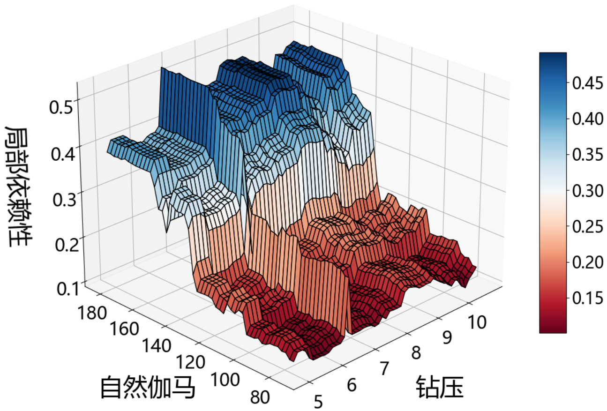
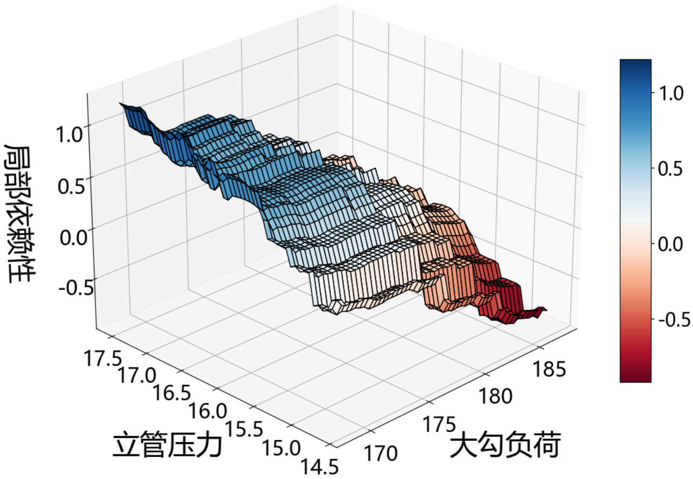

# **Smart drilling**

<div style="display: flex; flex-wrap: wrap;">
  <div style="flex: 1; padding-right: 10px;">
    
    <h4>Run screenshot 1</h2>
  </div>
  <div style="flex: 1; padding-left: 10px;">
    
    <h4>Run screenshot 2</h2>
  </div>
</div>


## Description of the project
1. The `GBDTLSTMModel` is a Python class used for time series prediction using the GBDT-LSTM model. The model combines shallow and deep learning techniques to effectively extract information from the data and handle non-linear relationships to improve prediction accuracy.
2. The `LstmCnnModel` is a Python class that implements a classification model based on a hybrid long short-term memory-convolutional neural network (LSTM-CNN) architecture.
3. The `GBDTModel` class is a Python implementation of a gradient boosting regression model that includes various methods for reading data, training the model, making predictions, and visualizing the results.


***
## Functions of the project
**Function 1: ROP_predict**

- `__init__(self, path_train, path_predict, test_ratio=0.2, n_past=80, optimizer='adam')`: The constructor of the class. It initializes the GBDT-LSTM model and loads the training and prediction data from the specified paths. It takes the following parameters:
  - `path_train`: The path to the training data file.
  - `path_predict`: The path to the data file used for prediction.
  - `test_ratio`: The ratio of test data to total data used for model evaluation. Default is 0.2.
  - `n_past`: The number of time steps in the past used for predicting future values. Default is 80.
  - `optimizer`: The optimizer used for training the LSTM model. Default is 'adam'.
- `read_data(self, path)`: Reads data from the specified path and returns it as a Pandas DataFrame.
- `train_gbdt(self, data_train)`: Processes and trains the given training data to generate the GBDT model.
- `createXY(self, datasets)`: Converts the dataset to the input and output format suitable for the LSTM model.
- `_build_and_fit_model(self, X_train, y_train, X_test, y_test)`: Builds and fits the LSTM model.
- `train_lstm(self, data_train)`: Processes and trains the given training data to generate the LSTM model.
- `lstm_predict(self, X_test)`: Uses the trained LSTM model to predict the values of the test data and returns the predictions.
- `predict(self)`: Predicts the values of the test data using the GBDT-LSTM model. It returns the real values, GBDT model predictions, and LSTM model predictions. The real values and GBDT model predictions are used for training the LSTM model, while the LSTM model predictions are used for final prediction.


**Function 2: risk_predict**
- `__init__(self, path_train, path_predict, learning_rate=0.001, beta_1=0.9, beta_2=0.999, epsilon=1e-08, weight_decay=1e-4, num_lstm_layers=2, lstm_hidden_size=16, cnn_num_units=128, num_epochs=5, validation_split_ratio=0.1, batch_size=128)`: Initializes the LstmCnnModel class by setting various parameters and hyperparameters for the neural network model.
- `_load_data(self)`: Loads the dataset specified by the file paths provided in `__init__()`, preprocesses it, and stores it in instance variables.
- `_build_model(self)`: Constructs an LSTM-CNN hybrid model in Tensorflow 2.0, which is the backbone of the LstmCnnModel object.
- `train(self)`: Trains the LSTM-CNN model using the training data provided in `__init__()`.
- `predict(self)`: Predicts the labels of new data using the trained LSTM-CNN model.

**Function 3: GBDT_pdp**
- `__init__(self, path_train, path_test, pathtosave)`: Initializes an instance of the GBDTModel class.
- `read_data(self, path)`: Reads data from an Excel file at the specified path.
- `train(self)`: Trains the gradient boosting regression model using the training data.
- `predict(self)`: Uses the trained gradient boosting regression model to predict the values of the response variable for the test data.
- `predict_plot(self)`: Creates a scatter plot of predicted values versus actual values from the test data.
- `plot_pdp(self, feature_name)`: Creates a 3D surface plot of the partial dependence of the response variable on two specified features.
***

## The operating environment of the project
-   keras == 2.11.0
-	Matplotlib == 3.6.3
-	Numpy == 1.22.4
-	Pandas == 1.5.3
-	scikit-learn == 1.2.2
-	tensorflow == 2.11.0
-	docx == 0.2.4
***

## How to use the project
1. To use the `GBDTLSTMModel` class for time series prediction, you need to create an object of the class and specify the paths to the training and prediction data files. Then, you can use the `predict` method to predict the values of the test data. 
    ```python
    path_train = 'path_train.xlsx'
    path_predict = 'path_predict.xlsx'
    model = GBDTLSTMModel(path_train, path_predict)
    y_test, y_test_predict, y_pred_future = model.predict()
    print(y_test, y_test_predict, y_pred_future)
    ```
2. To use the LSTM-CNN model, you first need to create an instance of the LstmCnnModel class by specifying your training and prediction dataset paths as well as any other hyperparameters you want to set. Then, you can call the `train()` function to train the model and the `predict()` function to obtain predictions from new data.
    ```python
    path_train='train_data.xlsx'
    path_predict='test_data.xlsx'
    model=LstmCnnModel(path_train, path_predict, learning_rate=0.001,  lstm_hidden_size=32,  num_epochs=10)
    model.train()
    predictions = model.predict()
    print(predictions)
    ```
3. To use the `GBDTLSTMModel` class for time series prediction, you need to create an object of the class and specify the paths to the training and prediction data files. Then, you can use the `predict` method to predict the values of the test data. 
    ```python
    path_train = 'path_train.xlsx'
    path_predict = 'path_predict.xlsx'
    path_save = 'save'
    first_feature = 'DEPTH'
    second_feature = 'TQA'
    model = GBDTModel(path_train , path_predict, path_save)
    model.train()
    model.predict()
    model.plot_pdp(['DEPTH', 'TQA'])
    ```

4. In `RISK` file, involved the CNN feature extraction of logging data, followed by LSTM to effectively predict and classify downhole conditions into four categories.

5. In `ROP` file, a GBDT-LSTM model is constructed, which incorporates neighboring well assistance, successfully achieving predictive drilling ROP within the same well.

6. The `GBDTModel` class is a Python implementation of a gradient boosting regression model that includes various methods for reading data, training the model, making predictions, and visualizing the results.